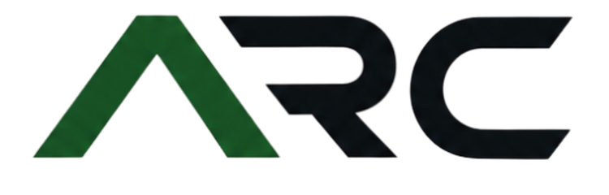
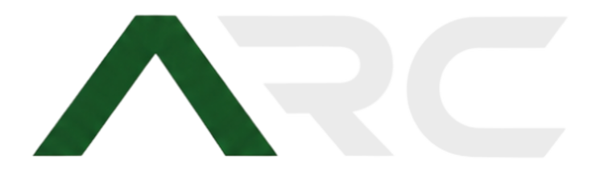

# Autonomous Robotics Club (ARC) Website

[](https://vercel.com)
[](https://kit.svelte.dev/)
[](https://tailwindcss.com/)
[](https://bun.sh/)

## Overview
This platform serves as the public website for the ARC Team, currently focused on developing collaborative autonomous systems for the **2025-2026 Raytheon Autonomous Vehicle Competition (AVC)**.

The website provides a centralized overview of:
- Our mission statement and technical capabilities.
- Live system statuses and events.
- The official Drone and Ground Team directory.
- Curated access to all active tracking/software repositories.
- Community Discord connections and organizational meeting schedules.

## Tech Stack
This project is built using modern edge technologies optimized for static workflows:
- **Framework**: [Svelte 5](https://svelte.dev/) & [SvelteKit](https://kit.svelte.dev/) utilizing runes and snippet design patterns. 
- **Styling**: [Tailwind CSS](https://tailwindcss.com/) implementing inline utilities mapped via `@theme`.
- **Icons**: [@iconify/svelte](https://iconify.design/) providing scalable vector illustrations without heavy payload sizes.
- **Runtime**: [Bun](https://bun.sh/) for ultra-fast dependency management and compilation speeds.
- **3D**: [three.js](https://threejs.org/) loaded through a dynamic import so it ships as its own chunk.

## Motion and 3D

The homepage carries two three.js features, both built from primitive shapes in `src/lib/models/`:

- `DroneScan.svelte` — a full-viewport quadcopter flyover. It plays on roughly half of homepage loads, flies in, turns to look around, then leaves and tears itself down.
- `DecorModel.svelte` — small looping models tucked into the corner of four homepage cells. Each can be spun with the mouse and keeps its momentum after release.

Both are desktop only (`min-width: 768px`), so phones never download the three.js chunk, and both pause their render loop while off-screen.

### Reducing motion

`src/lib/motion.ts` holds the site-wide motion preference as a Svelte store. It starts from the visitor's `prefers-reduced-motion` setting and is overridden by the toggle in the footer, which persists to `localStorage` under `arc-reduce-motion`.

When motion is reduced, `<html>` carries `data-reduce-motion="true"`. That attribute is set before first paint by the inline script in `src/app.html`, and `src/lib/theme/theme.css` uses it to collapse CSS animations and transitions. The two three.js components subscribe to the store directly: the flyover never starts (and stops if it is already in the air), and the decor models render a single static frame.

## Member accounts and attendance

Club members have accounts on this site only. They cannot sign in to ARC Manage, which
is for officers; the two use separate credentials and separately signed tokens.

- `/account` — set up an account with the club ID an officer issued, then sign in to
  edit name, email, major and year, upload a profile picture, or change password.
  Linked from the footer rather than the main nav, since it is only for members.
- `/attendance` — sign in to a meeting that is currently running. This one is in the
  main nav, because members need to reach it quickly during a meeting.

`src/lib/memberSession.ts` holds the session: it keeps the token in `localStorage` under
`arc-member-token` and exposes a `member` store the pages subscribe to.

Meeting sign in asks for a club ID, a GMU email, and the code an officer puts on screen
at the meeting. A member who is already signed in to their account skips the first two,
since the page fills them in from the session.

## Images

Photos, logos, and cover images all come from ARC Manage, which compresses them on
upload and serves them from `/api/media/serve/<filename>` with a one-year immutable
cache header. Nothing here keys off the file extension or MIME type, so it does not
matter whether a given file is stored as JPEG or PNG.

Every image that sits in a list, grid, or gallery carries `loading="lazy"` and
`decoding="async"`, so a page only fetches the pictures a visitor actually scrolls to.
The exceptions are deliberate and should stay eager:

- The static logos in the header and the two homepage and legacy heroes.
- The one large cover image at the top of a blog post, project, team member, or partner
  page. That image is the largest contentful paint on its page, and deferring it would
  make the page measurably slower.
- The lightbox images on the media pages, which are only rendered once opened and have
  to appear immediately.

## Logos

Brand assets live in `static/logos/`.

**Club logo** — homepage hero, favicon fallback, `og:image`, legacy header


**ARC wordmark** — navbar, light mode (`arcc.png`) and dark mode (`arcc_light.png`)




The navbar wordmark swap between the two is handled purely with CSS in `src/lib/theme/Header.svelte`, keyed off the `data-theme` attribute set on `<html>` (see `src/app.html`).

**Favicon** — `favicon.png`, available but not currently wired to `<link rel="icon">`


## Development Setup

To run the project locally, you will need to have [Bun](https://bun.sh/) installed on your machine.

1. **Clone the repository:**
   ```bash
   git clone https://github.com/ARC-GMU/rso-website.git
   ```

2. **Install dependencies:**
   ```bash
   bun install
   ```

3. **Start the development server:**
   ```bash
   bun run dev
   ```

You can now preview the application concurrently by navigating to `http://localhost:5173`.

## Deployment Architecture

This website is configured to be deployed on **Vercel** using `@sveltejs/adapter-vercel`.

### Vercel Deployment
The project is set up to deploy seamlessly on Vercel. 
1. Import the repository into your Vercel dashboard.
2. Vercel will automatically detect the SvelteKit project and use the `bun run build` command.
3. The site will be built and deployed automatically on every push to the `main` branch.
